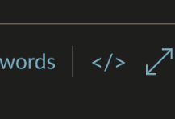

cmark-to-canvas
===============

Deno script to convert LaTeX-supported Commonmark to Canvas HTML.

Usage
-----

Run the script with the Markdown file as the first argument. The HTML will be
printed to stdout:

    ./cmark-to-canvas.ts ./example.md > example.html
    ./cmark-to-canvas.ts ./example.md | wl-copy # Copy to clipboard on Wayland

Then paste the HTML into Canvas' HTML editor by clicking this button:

Example Output
--------------

This Markdown:

    ## Hello, world!
    
    Here is some _sick_ $\LaTeX$:
    
    $$
    \begin{aligned}
      &\ \int x^3 + 2x^2 \ dx \\
    = &\ \int x^3 \ dx + \int 2x^2 \ dx \\
    = &\ \frac{1}{4}x^4 + \frac{2}{3}x^3 + C \\
    = &\ \frac{x^4}{4} + \frac{2x^3}{3} + C
    \end{aligned}
    $$

becomes

